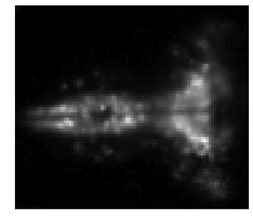

Basic usage
-----------

Thunder offers a variety of analyses and workflows for spatial and
temporal data. When run on a cluster, most methods are efficiently and
automatically parallelized, but Thunder can also be used on a single
machine, especially for testing purposes.

We'll walk through a very simple example here as an introduction. The
entry point for most workflows is the ``ThunderContext``. If you type
``thunder`` to start the interactive shell, this context is
automatically provided as ``tsc``, which is an object that primarily
provides functionality for loading and exporting data.

We'll start by loading and exploring some toy example data:

.. code:: python

    data = tsc.loadExample('fish-series')
``data`` is a ``Series`` object, which is a generic collection of
one-dimensional array data sharing a common index. We can inspect it to
see metadata:

.. code:: python

    data

.. parsed-literal::

    Series
    nrecords: None (inspect to compute)
    dtype: float
    dims: None (inspect to compute)
    index: [  0   1   2   3   4   5   6   7   8   9  10  11 ... ] (length: 240)

A ``Series`` object is a collection of key-value records, each
containing an identifier as a key and a one-dimensional array as a
value. We can look at the first key and value by using ``first()``.

.. code:: python

    key, value = data.first()
We see that the ``first`` key in this example ``Series`` data is the
tuple (0,0,0), corresponding to an x, y, z coordinate of an original
movie.

.. code:: python

    key

.. parsed-literal::

    (0, 0, 0)

The value in this case is a time series of 240 observations, represented
as a 1d numpy array.

.. code:: python

    value.shape

.. parsed-literal::

    (240,)

We can extract a random subset of records and plot their time series,
after converting to ``TimeSeries`` (which enables time-specific
methods), and applying a simple baseline normalization. Here and
elsewhere, we'll use the excellent ``seaborn`` package for styling
figures, but this is entirely optional.

.. code:: python

    %matplotlib inline
.. code:: python

    import matplotlib.pyplot as plt
    import seaborn as sns
    sns.set_context("notebook")
.. code:: python

    examples = data.toTimeSeries().normalize().subset(50, thresh=0.05)
    sns.set_style('darkgrid')
    plt.plot(examples.T);

.. image:: basic_usage_files/basic_usage_14_0.png

We can also compute a statistic for each record using the method:

.. code:: python

    means = data.seriesStdev()
    means.first()

.. parsed-literal::

    ((0, 0, 0), 0.37996710383926657)

``means`` is now itself a ``Series``, where the value of each record is
the mean across time

For this ``Series``, since the keys correspond to spatial coordinates,
we can ``pack`` the results back into a local array. ``pack`` is an
operation that converts ``Series`` data, with spatial coordinates as
keys, into an n-dimensional numpy array. In this case, the result is 3D,
reflecting the original input data.

.. code:: python

    img = means.pack()
    img.shape

.. parsed-literal::

    (76, 87, 2)

``pack`` is an example of a local operation, meaning that all the data
involved will be sent to the Spark driver node. For larger data sets,
this can be very problematic - it's a good idea to downsample,
subselect, or otherwise reduce the size of your data before attempting
to ``pack`` large data sets!

To look at this array as an image, we'll use ``matplotlib`` via a helper
function included with Thunder.

.. code:: python

    from thunder import Colorize
    image = Colorize.image
    image(img[:,:,0])

It's also easy to export the result to a ``numpy`` or ``MAT`` file.

::

    tsc.export(img, "directory", "npy")
    tsc.export(img, "directory", "mat")

This will put a ``npy`` file or ``MAT`` file called ``meanval`` in the
folder ``directory`` in your current directory. You can also export to a
location of Amazon S3 or Google Storage if path is specified with an
``s3n://``\ or ``gs://`` prefix.

Thunder includes several other toy data sets, to see the available ones:

.. code:: python

    tsc.loadExample()

.. parsed-literal::

    ['fish-images',
     'fish-series',
     'iris',
     'mouse-images',
     'mouse-params',
     'mouse-series']

Some of them are ``Series``, some are ``Images``, and some are
associated ``Params`` (e.g. covariates). Let's load an ``Images``
dataset:

.. code:: python

    images = tsc.loadExample('mouse-images')
.. code:: python

    images

.. parsed-literal::

    Images
    nrecords: 500
    dtype: int16
    dims: min=(0, 0), max=(63, 63), count=(64, 64)

Now every record is an key-value pair where the key is an identifier,
and the value is an image

.. code:: python

    key, value = images.first()
The key is an integer

.. code:: python

    key

.. parsed-literal::

    0

And the value is a two-dimensional array

.. code:: python

    value.shape

.. parsed-literal::

    (64, 64)

Although ``images`` is not an array, some syntactic sugar supports easy
indexing:

.. code:: python

    im = images[0]
    image(im)

.. image:: basic_usage_files/basic_usage_37_0.png

And we can now apply simple parallelized image processing routines

.. code:: python

    im = images.gaussianFilter(3).subsample(3)[0]
    image(im)

.. image:: basic_usage_files/basic_usage_39_0.png

For both ``Images`` and ``Series`` data, there are a variety of more
complex analyses that can be run on these objects, including massively
parallel regression, factorization, registration, feature extraction,
and more! See the other tutorials for more information.
