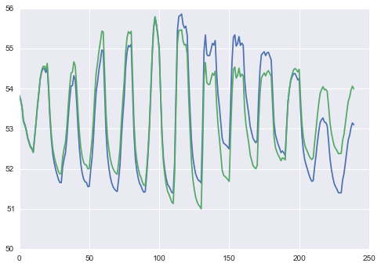

Series
------

A ``Series`` object is a distributed collection of 1D arrays, all of
which share a common index. It supports several manipulations and
computations on 1D data, some of which take the index into account.

The most common examples of Series objects are likely time series data,
in which each array represents a quantity that has been temporally
sampled at regular intervals. For example, a movie can be represented as
Series data, where a single record might consist of a pixel time series,
as in the ``fish-series`` and ``mouse-series`` example data from the
``basic usage`` tutorial.

The keys associated with Series records can be any data used to identify
the series, for example, a single sensor channel identifier, or tuples
representing pixel coordiantes (if derived from a movie). For example, a
Series record representing a time series from an outer corner of a movie
might have key (0, 0, 0), with the value being an array representing the
measurements at that location over time: [112, 110, 118, ..., 124].

Here, we show examples of loading and manipulating Series data.

Setup plotting
--------------

.. code:: python

    %matplotlib inline
.. code:: python

    import matplotlib.pyplot as plt
    import seaborn as sns
    sns.set_context('notebook')
Loading series
--------------

Series can be loaded from a ``ThunderContext`` using the ``loadSeries``
method. (See the ``Input formats`` tutorial for more detail on loading
methods and formats.) Here, we'll again load the "fish-series" example
data set:

.. code:: python

    data = tsc.loadExample('fish-series')
Inspection
----------

Let's plot a random subset of the data using the ``subset`` method,
which thresholds based on the standard deviation:

.. code:: python

    examples = data.subset(nsamples=50, thresh=1)
    plt.plot(examples.T[0:20,:]);

.. image:: series_files/series_8_0.png

Note the variation in raw intensity levels.

Processing
----------

A ``Series`` object has various methods for processing and transforming
the data. For example, ``center`` subtracts the mean, ``squelch`` sets
to 0 any records not exceeding a threshold, and ``zscore`` subtracts the
mean and divides by the standard deviation. Note the changes in the
y-axis.

.. code:: python

    examples = data.center().subset(nsamples=50, thresh=10)
    plt.plot(examples.T[0:20,:]);

.. image:: series_files/series_11_0.png

.. code:: python

    examples = data.squelch(150).zscore().subset(nsamples=50, thresh=0.1)
    plt.plot(examples.T[0:20,:]);

.. image:: series_files/series_12_0.png

Related methods include ``standardize``, ``detrend``, and ``normalize``
(the latter two are specified to ``TimeSeries``, see below)

Selections
----------

A ``Series`` has a 1D index, which can be used to subselect values.

.. code:: python

    data.index.shape

.. parsed-literal::

    (240,)

For example, to select a range:

.. code:: python

    data.between(0,8).first()

.. parsed-literal::

    ((0, 0, 0), array([ 26.,  26.,  26.,  26.,  26.,  26.,  26.,  25.,  26.]))

Note that the index changes to reflect the subselected range:

.. code:: python

    data.between(0,8).index

.. parsed-literal::

    [0, 1, 2, 3, 4, 5, 6, 7, 8]

We can also select based on an arbitrary criterion function:

.. code:: python

    data.select(lambda x: x < 5).index

.. parsed-literal::

    [0, 1, 2, 3, 4]

The default index generated for ``Series`` objects will be the range of
integers starting at zero and ending one before the length of the series
data, as shown in these examples. However, other data types can also be
used as the index for a series object, such as a sequence of strings,
providing text labels for each element in the series array, or a tuple
with indices at different levels. See the tutorial on Multi-indexing
tutorial for this usage.

Statistics
----------

A ``Series`` can be summarized with statistics both within and across
records. To summarize across records:

.. code:: python

    plt.plot(data.toTimeSeries().normalize().max());
    plt.plot(data.toTimeSeries().normalize().mean());
    plt.plot(data.toTimeSeries().normalize().min());

.. image:: series_files/series_24_0.png

To summarize within records:

.. code:: python

    data.seriesMean().first()

.. parsed-literal::

    ((0, 0, 0), 25.824999999999999)

.. code:: python

    data.seriesStdev().first()

.. parsed-literal::

    ((0, 0, 0), 0.37996710383926657)

We can also correlate each record with a signal of interest. As
expected, for a random signal, the correlation should be near 0.

.. code:: python

    from numpy import random
    signal = random.randn(240)
    data.correlate(signal).first()

.. parsed-literal::

    ((0, 0, 0), 0.063411240679893649)

Keys
----

We often use integer keys to index the records of a ``Series``, and
sometimes these keys represent indices into some original array (for
example, indices into a multi-dimensional tensor, or pixel coordinates
if the records are time series from a movie).

A few convenience methods are provided for working with keys. First, the
attribute ``dims`` contains information about the range of the keys.
Computing this requires a pass through the data, but if computed on a
``Series`` it will be inherited by all derived objects, to avoid
recomputation.

.. code:: python

    data.dims.max

.. parsed-literal::

    (75, 86, 1)

.. code:: python

    data.dims.min

.. parsed-literal::

    (0, 0, 0)

For keys that correspond to subscripts (e.g. indices of the rows and
columns of a matrix, coordinates in space), we can convert between
subscript and linear indexing. The default for these conversions is
currently onebased subscript indexing, so we need to set ``onebased`` to
``False`` (this will likely change in a future release).

.. code:: python

    data.keys().take(10)

.. parsed-literal::

    [(0, 0, 0),
     (1, 0, 0),
     (2, 0, 0),
     (3, 0, 0),
     (4, 0, 0),
     (5, 0, 0),
     (6, 0, 0),
     (7, 0, 0),
     (8, 0, 0),
     (9, 0, 0)]

.. code:: python

    data.subToInd(isOneBased=False).keys().take(10)

.. parsed-literal::

    [0, 1, 2, 3, 4, 5, 6, 7, 8, 9]

.. code:: python

    data.subToInd(isOneBased=False).indToSub(isOneBased=False).keys().take(10)

.. parsed-literal::

    [(0, 0, 0),
     (1, 0, 0),
     (2, 0, 0),
     (3, 0, 0),
     (4, 0, 0),
     (5, 0, 0),
     (6, 0, 0),
     (7, 0, 0),
     (8, 0, 0),
     (9, 0, 0)]

The ``query`` method can be used to average subselected records based on
their (linearized) keys. It returns the mean value and key for each of
the provided index lists.

.. code:: python

    keys, values = data.query(inds=[[100,101],[200]], isOneBased=False)
.. code:: python

    keys

.. parsed-literal::

    array([[ 25.5,   1. ,   0. ],
           [ 50. ,   2. ,   0. ]])

.. code:: python

    values.shape

.. parsed-literal::

    (2, 240)

The ``pack`` method collects a series into a local array, reshaped based
on the keys. If there are multiple values per record, all will be
collected into the local array, so typically we select a subset of
values before packing to avoid overwhelming the local returning a very
large amount of data.

.. code:: python

    out = data.select(0).pack()
    out.shape

.. parsed-literal::

    (76, 87, 2)

.. code:: python

    out = data.between(0,2).pack()
    out.shape

.. parsed-literal::

    (3, 76, 87, 2)

Conversions
-----------

Subclasses of ``Series`` provide additional functionality for more
specialized data types.

A ``TimeSeries`` provides methods specific to time-varying data, like
``fourier``, for computing the statistics of a Fourier transform:

.. code:: python

    ts = data.toTimeSeries()
    fr = ts.fourier(freq=5)
    fr.index

.. parsed-literal::

    ['coherence', 'phase']

.. code:: python

    fr.select('coherence').first()

.. parsed-literal::

    ((0, 0, 0), 0.17186687287857189)

Or detrend for detrending data over time

.. code:: python

    plt.plot(ts.mean())
    plt.plot(ts.detrend('nonlinear', order=5).mean());

A ``RowMatrix`` provides a variety of methods for working with
distributed matrices and matrix operations:

.. code:: python

    mat = data.toRowMatrix()
.. code:: python

    from thunder import Colorize
    Colorize.image(mat.cov())

.. image:: series_files/series_52_0.png

