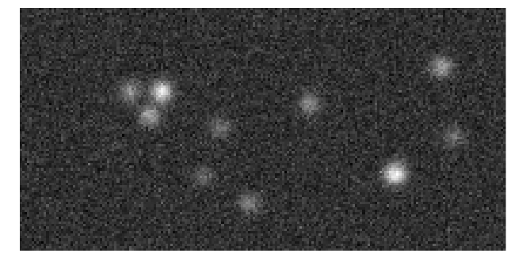
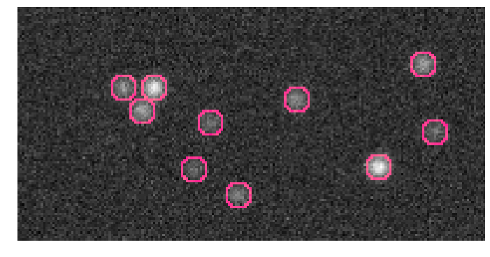
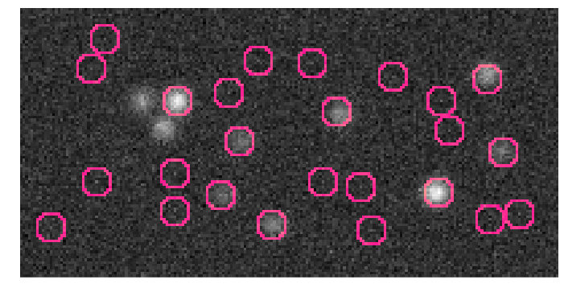
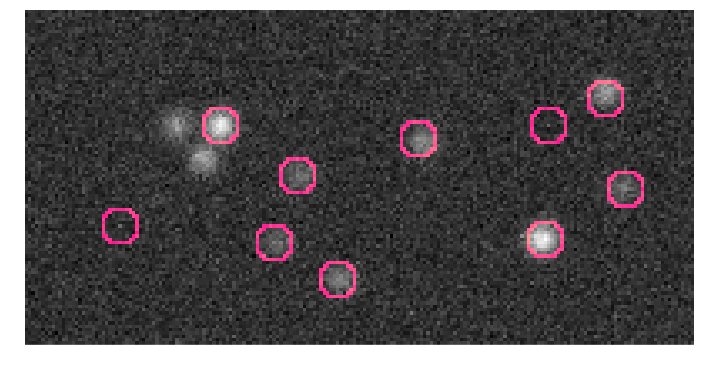
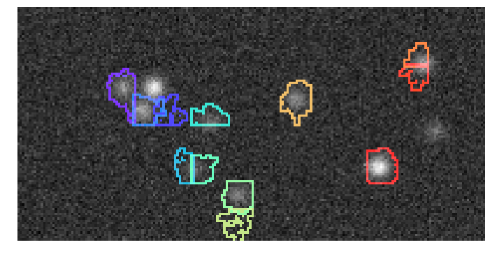
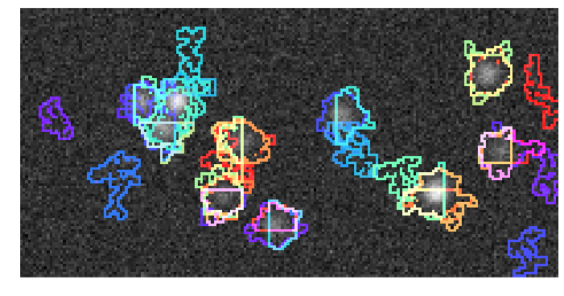
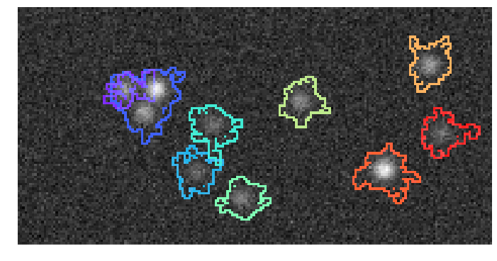

Running source extraction algorithms
------------------------------------

In this notebook, we use simulated data to introduce source extraction
algorithms.

Setup plotting
--------------

.. code:: python

    %matplotlib inline
    from thunder import Colorize
    image = Colorize.image
    import seaborn as sns
    figsize = 12
Create data with ground truth
-----------------------------

.. code:: python

    data, ts, truth = tsc.makeExample('sources', centers=10, noise=1.0, returnParams=True)
The data set is an ``Images`` object, in this case 100 images of size
100 x 200

.. code:: python

    data

.. parsed-literal::

    Images
    nrecords: 100
    dtype: float
    dims: min=(0, 0), max=(99, 199), count=(100, 200)

Look at the mean image

.. code:: python

    im = data.mean()
.. code:: python

    image(im, size=11)

Confirm that the ground truth exactly matches the sources, using the
``masks`` method to see the source outlines

.. code:: python

    image(truth.masks((100,200), base=im, outline=True), size=figsize)

Run an algorithm
----------------

Many common algorithms with sensible defaults are availiable directly
through the top level ``SourceExtraction`` class and can be called by
name.

We'll start by using the ``localmax`` method, which is an example of a
"feature method". These methods compute simple statistics on the data
and them use image-based operations to identifty likely sources. The
local max algorithms simply identified sources around local peaks in the
mean image.

.. code:: python

    from thunder import SourceExtraction
    model = SourceExtraction('localmax')
We can use the model to ``fit`` the data, which yields a ``SourceModel``

.. code:: python

    sources = model.fit(data)
.. code:: python

    image(sources.masks((100, 200), base=im, outline=True), size=figsize)

Some methods have parameters, such as the ``maxSources`` method for this
method, which will likely improve the result by eliminating false
positives

.. code:: python

    sources = SourceExtraction('localmax', maxSources=10).fit(data)
    image(sources.masks((100, 200), base=im, outline=True), size=figsize)

Run a block algorithm
---------------------

Another classes of algorithms perform operations on spatio temporal
blocks to identify sources locally, and then merge sources across
blocks. A variety of local operations are possible; many are based on
matrix factorization, for example, non-negative matrix factorization.

.. code:: python

    model = SourceExtraction('nmf')
When fitting this mode, we need to specify the size of the block as an
argument

.. code:: python

    sources = model.fit(data, size=(25,25))
.. code:: python

    sources

.. parsed-literal::

    SourceModel
    12 sources

Look at the result; it's likely not very good due to artifacts at the
block boundaries

.. code:: python

    image(sources.masks((100, 200), base=im, outline=True, color='random'), size=figsize)

We can improve things by padding the blocks through an extra argument
during fitting

.. code:: python

    sources = model.fit(data, size=(25,25), padding=7)
.. code:: python

    sources

.. parsed-literal::

    SourceModel
    43 sources

You'll find that all sources were found, but many now overlap (due to
the padded region)

.. code:: python

    image(sources.masks((100, 200), base=im, outline=True, color='random'), size=figsize)

This can be improved through the use of a custom merger, for example,
the ``OverlapBlockMerger``, which will merge sources from each block to
those in adjacent blocks so long as they overlap by a certain fraction.

.. code:: python

    from thunder.extraction import OverlapBlockMerger
.. code:: python

    model = SourceExtraction('nmf', merger=OverlapBlockMerger(0.25), minArea=100)
.. code:: python

    sources = model.fit(data, size=(25,25), padding=7)
.. code:: python

    sources

.. parsed-literal::

    SourceModel
    9 sources

.. code:: python

    image(sources.masks((100, 200), base=im, outline=True, color='random'), size=figsize)

